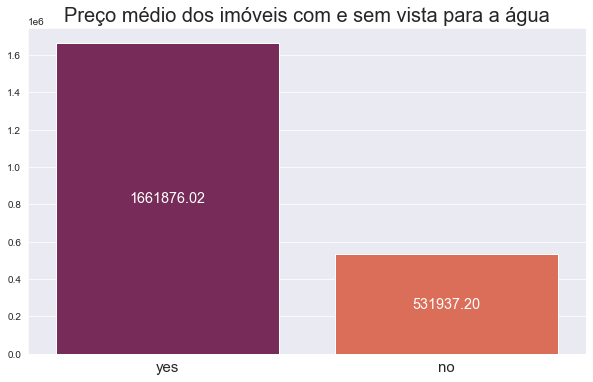
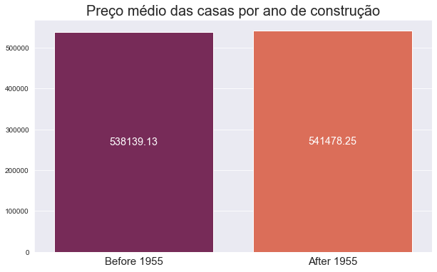
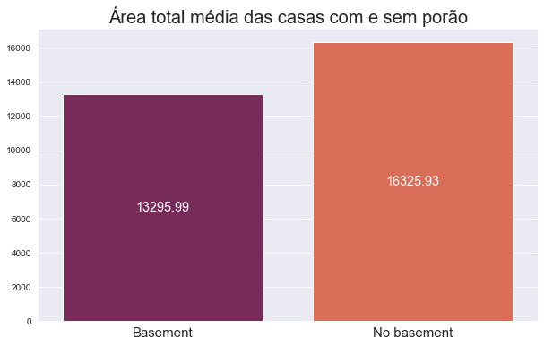
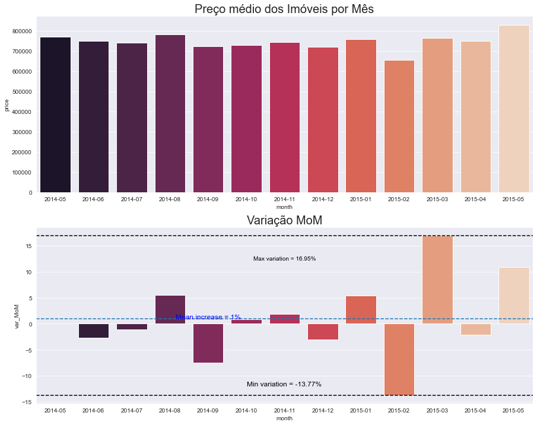
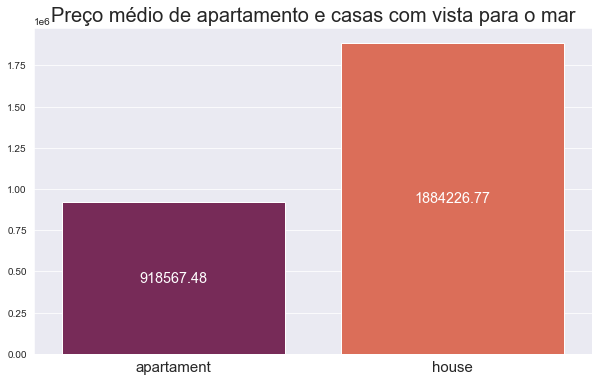
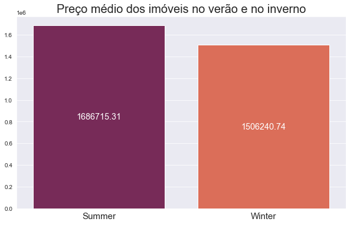
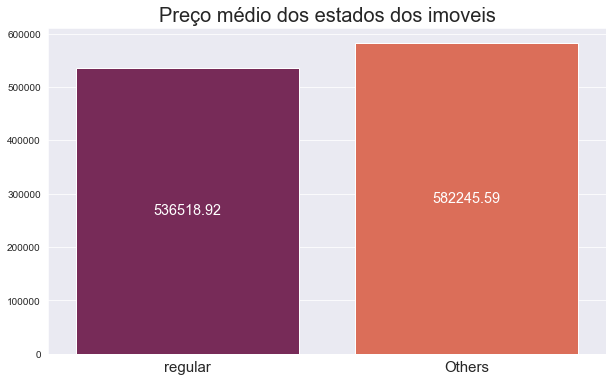
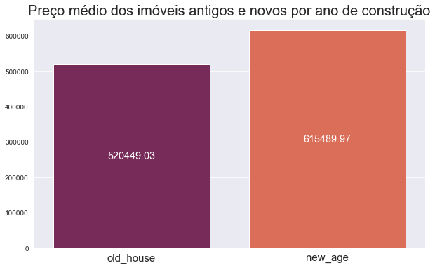
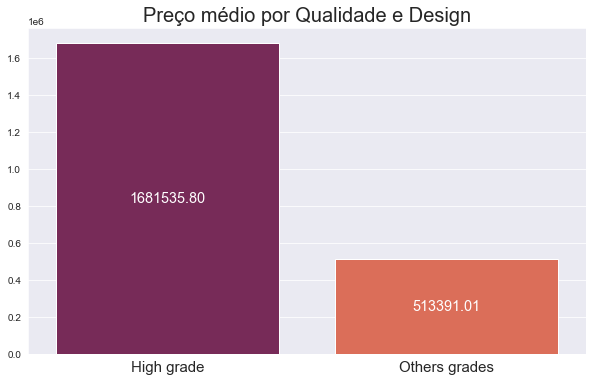
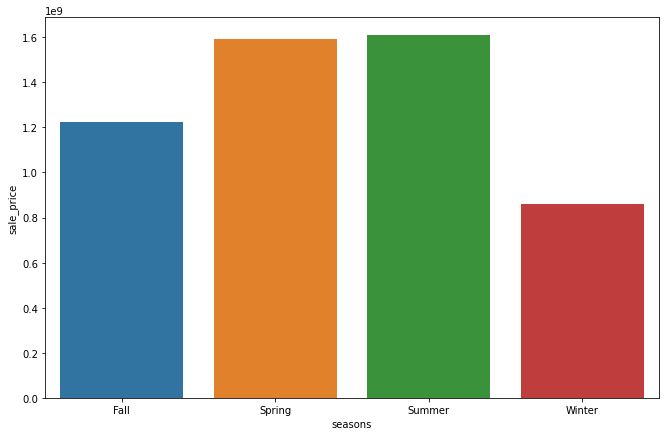

# KC_HOUSE_ROCKET_INSIGHTS

  

**Aviso:** O dados foram extraídos do site https://www.kaggle.com/harlfoxem/housesalesprediction, a empresa existe e os resultados apresentados nesse projeto não tem vínculo com os resultados reais da empresa, o contexto, o CEO, e as questões de negócios existem apenas para elaboração desse contexto.

# **Vizualização**
<a href="https://insights-kc-house-rocket-dash.herokuapp.com/">DASHBOARD KC HOUSE ROCKET INSIGHTS</a>

<h2>1. Problemas de Negócio</h2>
<h3>1.1. Contextualização</h3>

A KC House Rocket é uma empresa de compra e venda de imóveis localizada em Seattle (EUA) utilizando plataforma digital.

Seu CEO deseja aumentar a receita da empresa com base em decisões em dados para que tenha as melhores oportunidades de compra e venda dos imóveis. A principal estratégia é comprar as casas mais baratas e revender no futuro, quanto maior é essa diferença entre a compra e a venda do imóvel, maior é seu lucro.

<h3>1.2. Necessidade</h3>

Achar boas oportunidades é uma tarefa difícil pela quantidade de características que um imóvel tem. Então, o CEO necessita de uma análise para responder à essas questões:

<ul>
    <li>Quais casas o CEO deveria comprar?</li>
    <li>Verificar se as hipóteses entregues pelo CEO estão corretas</li>
    <li>Gráficos simples porém dinâmicos para o CEO fazer as próprias análises</li>
    <li>O CEO precisa passar algumas informações para a equipe de contribuintes</li>
</ul>
<h3>1.3. Hipóteses</h3>
<ol>
    <li>Imóveis com vista para água, na média, são 20% mais caros!</l1>
    <li>Imóveis com data de construção menor que 1955, são 50% mais baratos, na média.</li>
    <li>Imóveis sem porão possuem área total (sqrt_lot), são 50% maiores do que com porão.</li>
    <li>O crescimento do preço dos imóveis YoY ( Year over Year ) é de 10%.</li>
    <li>Imóveis com 3 banheiros tem um crescimento MoM (Month over Month) de 15% em média.</li>
    <li>Os apartamentos com vista para o mar são em  média de 50% a 60% mais baratos do que as casas.</li>
    <li>O valor de imoveis com vista para o mar no verão é 30% mais cara do que no inverno em média.</li>
    <li>O valor de imoveis de condição regular é até 10% mais barata que os demais em média.</li>
    <li>O valor de imoveis antigos é 10% maior que os novos por ano de construção.</li>
    <li>Casas com um alto grau de qualidade e design são até 50% mais caras em nédia.</li>
</ol>

<h2>2. Estratégia de Solução</h2>
<ul>
    <li>Utilizar o banco de dados disponibilizado pela House Rocket para fazer a limpeza dos dados e também análises.</li>
    <li>Validação das hipóteses por meio de Exploratory Data Analysis.</li>
    <li>Cria colunas adicionais oriundas de cruzamentos de dados para complementar as análises.</li>
    <li>Criar plataforma utilizando o Streamlit para fazer uma visualização simples e personalizável para analisar os dados com nível de acesso.</li>
   <li> As seguintes ferramentas foram usadas na construção do projeto:

- [Python](https://www.python.org/)
- [Streamlit](https://streamlit.io/)
- [Pandas](https://pandas.pydata.org/)
    
</ul>

<h2>3. Exploratory Data Analysis</h2>
<ol>
    <li>Imóveis que possuem vista para água, são 30% mais caros, na média.</l1>
    <ul>
        <li>Diferença percentual de preços: 212%, então a afirmativa é falsa porque esse valor é maior que 30%.</li>
        

        
        
 
    </ul>
    <li>Imóveis com data de construção menor que 1955, são 50% mais baratos, na média.</li>
    <ul>
        <li>Diferença percentual de preços: 1% ,então a afirmativa é falsa porque esse valor é menor que 10%.</li>
        

        
        
 
    </ul>
    <li>Imóveis sem porão possuem área total (sqrt_lot), são 50% maiores do que com porão.</li>
    <ul>
        <li>Diferença percentual de preços: 19%, então a afirmativa é falsa porque esse valor é menor que 50%.</li>
                

        
        
 
    </ul>
    <li>O crescimento do preço dos imóveis YoY ( Year over Year ) é de 10%.</li>
    <ul>
        <li>Diferença percentual de preços: 1%, então a afirmativa é falsa porque esse valor é menor que 10%.</li>
                

        
        
 
    </ul>
    <li>Imóveis com 3 banheiros tem um crescimento MoM (Month over Month) de 15%.</li>
    <ul>
        <li>Diferença percentual de preços: 3%, então a afirmativa é falsa porque esse valor é menor que 10%.</li>
                

        
        
 
    </ul>
    <li>Os apartamentos com vista para o mar são em  média de 50% a 60% mais baratos do que as casas.</li>
    <ul>
        <li>Diferença percentual de preços: 51% , então a afirmativa é verdadeira porque esse valor está entre os 50% e 60%.</li>
                

        
        
 
    </ul>
    <li>O valor de imoveis com vista para o mar no verão é 30% mais cara do que no inverno em média.</li>
    <ul>
        <li>Diferença percentual de preços: 12% , então a afirmativa é falsa porque esse valor é menor que 30%.</li>
                

        
        
 
    </ul>
        <li>O valor de imoveis de condição regular é até 10% mais barata que os demais em média.</li>
    <ul>
        <li>Diferença percentual de preços: 8% , então a afirmativa é verdadeira porque esse valor é até 10% mais barato que as demais.</li>
                

        
        
 
    </ul>
        <li>O valor de imoveis antigos é 10% maior que os novos por ano de construção.</li>
    <ul>
        <li>Diferença percentual de preços: 15% , então a afirmativa é Falsa porque esse valor é 15% mais barato que as demais.</li>
                

        
        
 
    </ul>
        <li>Casas com um alto grau de qualidade e design são até 50% mais caras em nédia.</li>
    <ul>
        <li>Diferença percentual de preços: 228% , então a afirmativa é Falsa porque esse valor é mais alto que 50%.</li>
                

        
        
 
    </ul>
</ol>

<h2>4. Conclusão</h2>

Após a análise, dentre os 21.435 imóveis disponíveis para a compra na região de King Country, 10.499 foram sugeridos para compra e detalhados na tabela de dados.
Caso os imóveis sugeridos sejam comprados, o investimento inicial esperado é de $4 bilhões. Após a revenda de todos os imóveis, será arrecadado um total de $5,2 bilhões de dólares e o lucro total previsto é de $1,2 bilhões, totalizando 30% de retorno sobre o capital incialmente investido

| seasons | price | sale_price | gain |
|---|---|---|---|
|	Fall |	942.686.464,00 |	1.225.492.403,20 |	282.805.939,20 |
|	Spring |	1.223.494.005,00 |	1.590.542.206,50 |	367.048.201,50 |
|	Summer |	1.236.986.085,00 |	1.608.081.910,50 |	371.095.825,50 |
|	Winter |	660.219.286,00 |	858.285.071,80 |	198.065.785,80 |

 

<h2>5. Próximos Passos</h2>
<ul>
    <li>Aplicar métodos mais robustos para o tratamento de outliers</li>
    <li>Aplicar modelo de machine learning capaz de avaliar boas oportunidades de compra considerando os atributos do imóvel.</li>
    <li>Aplicar modelo de machine learning capaz de recomendar o melhor preço de venda das casas.</li>
    <li>Agendar a coleta dos dados atualizados e execução do script automaticamente.</li>
</ul>

